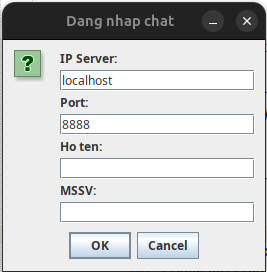
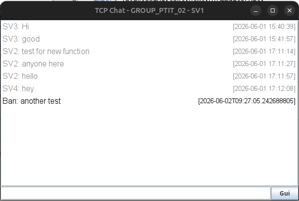

# TCP Chat Application - Group Chat System

Ứng dụng chat TCP Socket hỗ trợ nhiều nhóm chat riêng biệt, lưu và tự động tải lịch sử khi đăng nhập.

**Version:** 2.1 (History Support)

---

## 📋 Yêu Cầu Hệ Thống

- **Java:** JDK 8 hoặc cao hơn
- **MySQL:** 5.7 hoặc cao hơn
- **IDE:** NetBeans, Eclipse, IntelliJ IDEA (hoặc dùng lệnh terminal)
- **MySQL Driver:** mysql-connector-j 8.3.0 (tự động nếu dùng Maven)

---

## 🗄️ Tạo Database

### 1. Kết Nối MySQL
```bash
mysql -u root -p
```

### 2. Tạo Database
```sql
CREATE DATABASE Chat;
USE Chat;
```

### 3. Tạo Table Groups
```sql
CREATE TABLE IF NOT EXISTS chat_groups (
    id INT AUTO_INCREMENT PRIMARY KEY,
    group_name VARCHAR(50) UNIQUE NOT NULL,
    created_at TIMESTAMP DEFAULT CURRENT_TIMESTAMP
);
```

### 4. Thêm Dữ liệu Mẫu
```sql
INSERT IGNORE INTO chat_groups (group_name) VALUES 
('GROUP_PTIT_01'),
('GROUP_PTIT_02'),
('GROUP_PTIT_03');
```

### 5. Tạo Table Chat History
```sql
CREATE TABLE IF NOT EXISTS chat_history (
    id INT AUTO_INCREMENT PRIMARY KEY,
    sender VARCHAR(100) NOT NULL,
    message TEXT NOT NULL,
    group_name VARCHAR(50) NOT NULL,
    created_at TIMESTAMP DEFAULT CURRENT_TIMESTAMP,
    FOREIGN KEY (group_name) REFERENCES chat_groups(group_name)
);
```

### 6. (Tuỳ chọn) Tạo User cho App
```sql
CREATE USER 'chatuser'@'localhost' IDENTIFIED BY 'password123';
GRANT ALL PRIVILEGES ON Chat.* TO 'chatuser'@'localhost';
FLUSH PRIVILEGES;
```

---

## 🔧 Cấu Hình Database

Mở file: `src/main/java/dack/database/MyConnect.java`

**Cập nhật thông tin kết nối theo username/password MySQL của bạn:**
```java
String URL = "jdbc:mysql://localhost:3306/Chat?allowPublicKeyRetrieval=true&useSSL=false";
Connection conn = DriverManager.getConnection(URL, "your_username", "your_password");
```

> ⚠️ **Lưu ý:** File `MyConnect.java` đang hardcode username và password. Hãy đổi thành thông tin MySQL của bạn trước khi chạy.

---

## 💻 Chạy Local (Trên Cùng 1 Máy)

### 1. Biên Dịch (Compile)
```bash
cd /path/to/DACK
mvn clean compile
```

### 2. Chạy Server
```bash
mvn exec:java -Dexec.mainClass="dack.server.ChatServer"
```

Output:
```
Server dang chay tai port 8888
```

### 3. Chạy Client (mở terminal mới)
```bash
mvn exec:java -Dexec.mainClass="dack.client.ChatClientGUI"
```

Chạy nhiều client cùng lúc bằng cách mở thêm terminal và lặp lại lệnh trên.

### 4. Đăng Nhập & Chọn Nhóm

**Dialog 1 - Thông tin kết nối:**
- **IP Server:** `localhost` (hoặc IP server nếu LAN)
- **Port:** `8888`
- **Họ Tên:** Tên của bạn
- **MSSV:** Mã sinh viên

**Dialog 2 - Chọn nhóm:**
- Danh sách nhóm được tải tự động từ server (lấy từ database)
- Chọn nhóm muốn join từ dropdown

**Sau khi đăng nhập:**
- 50 tin nhắn gần nhất của nhóm tự động hiển thị màu xám (non-blocking, không làm đơ UI)
- Đường kẻ `--- Tin nhắn mới ---` phân cách lịch sử với tin nhắn real-time

---

## 🌐 Chạy Trên LAN (Nhiều Máy)

### Yêu Cầu
- Tất cả máy kết nối trên cùng mạng WiFi/LAN
- Tường lửa (Firewall) cho phép port 8888

### 1. Cấu Hình Server (Máy Server)

**Bước 1:** Lấy IP của máy Server
```bash
# Linux/Mac
ifconfig | grep "inet "

# Windows
ipconfig
```

Ví dụ: `192.168.1.100`

**Bước 2:** Nếu MySQL ở máy khác, sửa file `MyConnect.java`:
```java
// Thay localhost thành IP máy chứa MySQL
String URL = "jdbc:mysql://192.168.1.50:3306/Chat?allowPublicKeyRetrieval=true&useSSL=false";
```

**Bước 3:** Chạy Server
```bash
mvn exec:java -Dexec.mainClass="dack.server.ChatServer"
```

### 2. Cấu Hình Client (Máy Client)

```bash
mvn exec:java -Dexec.mainClass="dack.client.ChatClientGUI"
```

**Cửa sổ đăng nhập:**
- **IP Server:** `192.168.1.100` (IP của máy Server)
- **Port:** `8888`
- **Họ Tên:** Tên của bạn
- **MSSV:** Mã sinh viên

---

## 🔒 Troubleshooting

### Lỗi: "Khong the ket noi toi server"

**Nguyên nhân:**
1. Server chưa chạy
2. IP/Port sai
3. Tường lửa chặn port 8888

**Giải pháp:**
```bash
# Linux: Cho phép port 8888
sudo ufw allow 8888

# Kiểm tra server đang chạy
netstat -an | grep 8888       # Linux/Mac
netstat -an | findstr 8888    # Windows
```

### Lỗi: "Loi ket noi DB"

**Nguyên nhân:**
1. MySQL chưa chạy
2. Username/Password trong `MyConnect.java` chưa được cập nhật
3. Database `Chat` chưa tạo

**Giải pháp:**
```bash
# Kiểm tra MySQL đang chạy
mysql -u root -p -e "SELECT 1"

# Tạo lại database theo hướng dẫn phần Tạo Database ở trên
```

### Lịch sử không hiển thị

**Nguyên nhân:**
1. Bảng `chat_history` chưa có dữ liệu (nhóm mới)
2. Lỗi kết nối DB khi server gọi `getHistory()`

**Giải pháp:** Kiểm tra console của server để xem log lỗi chi tiết.

---

## 📁 Cấu Trúc Project

```
DACK/
├── src/main/java/dack/
│   ├── client/
│   │   ├── ChatClientGUI.java      (Giao diện client, xử lý login)
│   │   └── IncomingReader.java     (Nhận & render tin: HISTORY, BROADCAST, SYSTEM)
│   ├── server/
│   │   ├── ChatServer.java         (Khởi động server, lắng nghe kết nối)
│   │   └── ClientHandler.java      (Xử lý từng client, gửi history sau login)
│   └── database/
│       ├── DBAccess.java           (Truy cập DB: update() và query())
│       └── MyConnect.java          (Kết nối MySQL, getGroups(), getHistory(), validateGroup())
├── src/main/resources/pic/
│   ├── login.png                   (Screenshot màn hình đăng nhập)
│   └── chat.png                    (Screenshot màn hình chat)
├── pom.xml                         (Maven config)
└── README.md                       (File này)
```

---

## 🚀 Tính Năng

- ✅ **Multi-Group Chat:** Hỗ trợ nhiều nhóm chat riêng biệt
- ✅ **Group Selection:** Client chọn nhóm từ dropdown khi đăng nhập
- ✅ **Load History:** Tự động tải 50 tin nhắn gần nhất khi join nhóm (non-blocking)
- ✅ **Real-time Chat:** Truyền tin tức thời qua TCP Socket
- ✅ **Responsive UI:** Giao diện JTextPane HTML tự động canh lề khi resize
- ✅ **Database History:** Lưu lịch sử chat với group_name và timestamp
- ✅ **Multi-Client Support:** Đa người dùng chat cùng lúc
- ✅ **Thread-Safe:** Sử dụng ConcurrentHashMap & CopyOnWriteArrayList
- ✅ **SQL Injection Protection:** PreparedStatement cho tất cả database query
- ✅ **HTML Escape:** Toàn bộ nội dung tin nhắn được escape tránh vỡ layout
- ✅ **180-second Timeout:** Socket timeout để tránh treo kết nối
- ✅ **System Messages:** Thông báo khi user vào/ra nhóm

---

## 🖼️ Screenshots

### Màn hình Đăng Nhập


### Màn hình Chat


---

## 📊 Giao Thức Truyền Tin

### Từ Client → Server

```
GET_GROUPS                      (Request danh sách nhóm có sẵn)
LOGIN|MSSV|HoTen|Group          (Đăng nhập vào nhóm cụ thể)
CHAT|noi_dung                   (Gửi tin nhắn)
```

### Từ Server → Client

```
GROUPS|GROUP1,GROUP2,GROUP3     (Danh sách nhóm từ database)
LOGIN_SUCCESS|GroupName         (Đăng nhập thành công)
LOGIN_FAILED|LyDo               (Đăng nhập thất bại)
HISTORY|sender|content|time    (Một tin nhắn lịch sử - gửi nhiều dòng liên tiếp)
HISTORY_END                     (Kết thúc phần lịch sử)
BROADCAST|sender|content|time  (Nhận tin real-time từ user khác)
SYSTEM|thong_bao                (Thông báo hệ thống - user join/leave)
```

### Luồng kết nối đầy đủ

```
Client                              Server
  |--- GET_GROUPS ----------------->|
  |<-- GROUPS|G1,G2,G3 ------------|
  |--- LOGIN|MSSV|Ten|Group ------->|
  |<-- LOGIN_SUCCESS|Group ---------|
  |<-- HISTORY|sender|msg|time -----|  (lặp lại, tối đa 50 dòng)
  |<-- HISTORY_END -----------------|
  |<-- SYSTEM|Ten da tham gia ------|
  |         [chat bình thường]      |
  |--- CHAT|noi_dung -------------->|
  |<-- BROADCAST|sender|msg|time ---|  (gửi đến các client khác trong nhóm)
```

---

## 👨‍💻 Tác Giả

- **Tác giả:** dngnguyen
- **Môn học:** Đánh Giá Hiệu Năng Mạng

---

## 📝 Ghi Chú

- **Port mặc định:** 8888
- **Charset:** UTF-8 (hỗ trợ tiếng Việt)
- **Database mặc định:** Chat
- **Socket Timeout:** 180 giây (3 phút)
- **Số tin lịch sử tải về:** 50 tin nhắn gần nhất mỗi lần join nhóm
- **Load history:** Non-blocking — chạy trên `IncomingReader` thread, UI không bị đơ

---

**Hỏi đáp:** Nếu có lỗi, kiểm tra console output của server để biết chi tiết lỗi.
