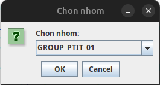
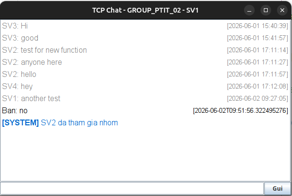
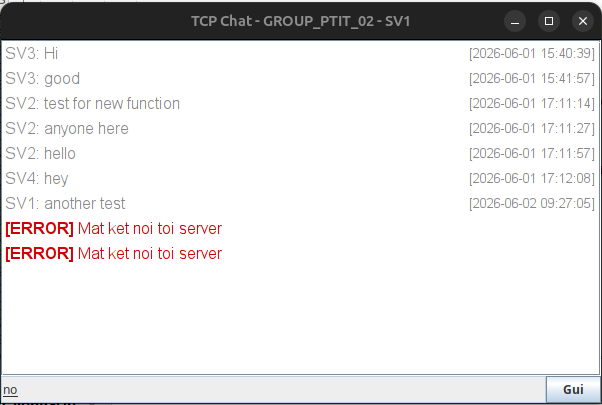

# 💬 TCP Chat — Group Chat System

<div align="center">


Ứng dụng chat TCP Socket.

**Version 2.1 — History Support**

</div>

---

## 📋 Mục Lục

- [Yêu Cầu Hệ Thống](#-yêu-cầu-hệ-thống)
- [Tạo Database](#️-tạo-database)
- [Cấu Hình Database](#-cấu-hình-database)
- [Chạy Local](#-chạy-local-trên-cùng-1-máy)
- [Chạy Trên LAN](#-chạy-trên-lan-nhiều-máy)
- [Cấu Trúc Project](#-cấu-trúc-project)
- [Tính Năng](#-tính-năng)
- [Giao Thức Truyền Tin](#-giao-thức-truyền-tin)
- [Troubleshooting](#-troubleshooting)

---

## 📋 Yêu Cầu Hệ Thống

| Thành phần            | Phiên bản                 |
| --------------------- | ------------------------- |
| **Java (JDK)**        | 25 trở lên                |
| **MySQL**             | 5.7 trở lên               |
| **Maven**             | 3.6 trở lên               |
| **MySQL Connector/J** | 8.3.0 (tự động qua Maven) |

> 💡 **IDE gợi ý:** NetBeans, IntelliJ IDEA, Eclipse — hoặc dùng lệnh terminal thuần.

---

## 🗄️ Tạo Database

### Bước 1 — Kết nối MySQL

```bash
mysql -u root -p
```

### Bước 2 — Tạo Database & Bảng

```sql
-- Tạo database
CREATE DATABASE IF NOT EXISTS Chat;
USE Chat;

-- Bảng nhóm chat
CREATE TABLE IF NOT EXISTS chat_groups (
    id         INT AUTO_INCREMENT PRIMARY KEY,
    group_name VARCHAR(50) UNIQUE NOT NULL,
    created_at TIMESTAMP DEFAULT CURRENT_TIMESTAMP
);

-- Bảng lịch sử tin nhắn
CREATE TABLE IF NOT EXISTS chat_history (
    id         INT AUTO_INCREMENT PRIMARY KEY,
    sender     VARCHAR(100) NOT NULL,
    message    TEXT NOT NULL,
    group_name VARCHAR(50) NOT NULL,
    created_at TIMESTAMP DEFAULT CURRENT_TIMESTAMP,
    FOREIGN KEY (group_name) REFERENCES chat_groups(group_name)
);
```

### Bước 3 — Thêm Dữ Liệu Mẫu

```sql
INSERT IGNORE INTO chat_groups (group_name) VALUES
    ('GROUP_PTIT_01'),
    ('GROUP_PTIT_02'),
    ('GROUP_PTIT_03');
```

### (Tuỳ chọn) Tạo User Riêng cho App

```sql
CREATE USER 'chatuser'@'localhost' IDENTIFIED BY 'your_password';
GRANT ALL PRIVILEGES ON Chat.* TO 'chatuser'@'localhost';
FLUSH PRIVILEGES;
```

---

## 🔧 Cấu Hình Database

Mở file: `src/main/java/dack/database/MyConnect.java`

Cập nhật thông tin kết nối theo MySQL của bạn:

```java
String URL = "jdbc:mysql://localhost:3306/Chat?allowPublicKeyRetrieval=true&useSSL=false";
Connection conn = DriverManager.getConnection(URL, "your_username", "your_password");
```

> ⚠️ **Lưu ý bảo mật:** File `MyConnect.java` đang hardcode username và password. **Thay thế bằng thông tin MySQL của bạn** trước khi chạy.

---

## 💻 Chạy Local (Trên Cùng 1 Máy)

### 1. Biên Dịch

```bash
cd /path/to/DACK
mvn clean compile
```

### 2. Chạy Server

```bash
mvn exec:java -Dexec.mainClass="dack.server.ChatServer"
```

Output mong đợi:

```
Server dang chay tai port 8888
```

### 3. Chạy Client (mở terminal mới)

```bash
mvn exec:java -Dexec.mainClass="dack.client.ChatClientGUI"
```

> Mở thêm terminal và lặp lại lệnh trên để chạy nhiều client cùng lúc.

### 4. Luồng Đăng Nhập

```
┌─────────────────────────────────────┐
│  Dialog 1 — Thông tin kết nối       │
│  ─────────────────────────────────  │
│  IP Server : localhost              │
│  Port      : 8888                   │
│  Họ Tên    : <tên của bạn>          │
│  MSSV      : <mã sinh viên>         │
└─────────────────────────────────────┘
              ↓
┌─────────────────────────────────────┐
│  Dialog 2 — Chọn/Tạo nhóm           │
│  ─────────────────────────────────  |
│  [+] Tao nhom moi...                |
│  Danh sách nhóm tải từ DB           │
│  Chọn hoặc tạo nhóm mới ▼           │
└─────────────────────────────────────┘
              ↓
    50 tin nhắn lịch sử hiển thị (nhạt)
    ──────── ✨ Tin nhắn mới ✨ ────────
    Bắt đầu chat real-time 🚀
```

---

## 🌐 Chạy Trên LAN (Nhiều Máy)

### Yêu cầu

- Tất cả máy cùng mạng WiFi / LAN
- Firewall cho phép port `8888`

### Máy chạy Server

**1. Lấy IP của máy Server:**

```bash
# Linux / macOS
ip addr show | grep "inet "

# Windows
ipconfig
```

Ví dụ kết quả: `192.168.1.100`

**2. (Nếu MySQL ở máy khác) Sửa `MyConnect.java`:**

```java
// Thay localhost → IP máy chứa MySQL
String URL = "jdbc:mysql://192.168.1.50:3306/Chat?allowPublicKeyRetrieval=true&useSSL=false";
```

**3. Chạy Server:**

```bash
mvn exec:java -Dexec.mainClass="dack.server.ChatServer"
```

### Máy chạy Client

```bash
mvn exec:java -Dexec.mainClass="dack.client.ChatClientGUI"
```

Ở Dialog đăng nhập:

- **IP Server:** `192.168.1.100` _(IP máy đang chạy server)_
- **Port:** `8888`

---

## 📁 Cấu Trúc Project

```
DACK/
├── src/
│   └── main/
│       ├── java/dack/
│       │   ├── client/
│       │   │   ├── ChatClientGUI.java     # Giao diện Swing, xử lý đăng nhập & gửi tin
│       │   │   └── IncomingReader.java    # Thread nhận & render tin: HISTORY, BROADCAST, SYSTEM
                └── SecurityUtil.java      # Mã hóa/giải mã tin nhắn (Rail Fence Cipher)
│       │   ├── server/
│       │   │   ├── ChatServer.java        # Khởi động server, lắng nghe kết nối TCP
│       │   │   └── ClientHandler.java     # Thread xử lý từng client, gửi history sau login
│       │   └── database/
│       │       ├── DBAccess.java          # Thực thi SQL: update() và query()
│       │       └── MyConnect.java         # Kết nối MySQL; getGroups(), getHistory(), validateGroup()
│       └── resources/
│           └── pic/
│               ├── login.png              # Screenshot màn hình đăng nhập
│               └── chat.png              # Screenshot màn hình chat
├── pom.xml                               # Maven config (Java 25, mysql-connector-j 8.3.0)
└── README.md
```

---

## 🚀 Tính Năng

### 🔒 Bảo mật & Tường lửa (Security & Firewall)

| Tính năng                             | Mô tả                                                                                                                                                                                                                                  |
| ------------------------------------- | -------------------------------------------------------------------------------------------------------------------------------------------------------------------------------------------------------------------------------------- |
| ✅ **Mã hóa đầu cuối (E2EE)**         | Tích hợp Rail Fence Cipher mã hóa tất cả tin nhắn. Dữ liệu truyền tải qua TCP Socket và Database đều ở dạng mã hóa. Server chỉ đóng vai trò trạm trung chuyển (Broadcast), không thể đọc nội dung gốc, đảm bảo tính riêm tư tuyệt đối. |
| ✅ **Tường lửa ứng dụng (Anti-Spam)** | Xây dựng cơ chế theo dõi thời gian thực dựa trên Time-based Rate Limiting. Ngăn chặn gửi tin nhắn liên tục (< 500ms/tin) để chống nghẽn mạng (DDoS tầng ứng dụng).                                                                     |
| ✅ **Auto-Kick Violation**            | Hệ thống tự động cảnh báo người dùng vi phạm spam. Nếu vi phạm quá 3 lần, Server chủ động ngắt kết nối (Kick) để giải phóng tài nguyên và gửi thông báo cảnh báo toàn phòng chat.                                                      |

### 👥 Quản lý Người dùng (User & Session Management)

| Tính năng                        | Mô tả                                                                                                                                                                                  |
| -------------------------------- | -------------------------------------------------------------------------------------------------------------------------------------------------------------------------------------- |
| ✅ **Định danh phiên độc quyền** | Kiểm soát truy cập dựa trên MSSV. Ngăn chặn tình trạng một tài khoản đăng nhập đồng thời nhiều lần vào cùng một nhóm chat, đảm bảo tính nhất quán của dữ liệu người dùng.              |
| ✅ **Real-time Presence List**   | Bổ sung UI hiển thị danh sách người dùng đang hoạt động bên phải màn hình. Server tự động Broadcast lệnh ONLINE_LIST để cập nhật lập tức mỗi khi có người mới Join/Leave hoặc bị Kick. |
| ✅ **Giới hạn quy mô phòng**     | Thiết lập chốt chặn số lượng người dùng tối đa cho mỗi nhóm để ngăn ngừa hiện tượng "bão Broadcast" (Broadcast Storm), giúp kiểm soát dung lượng RAM và giữ luồng mạng tối ưu.         |

### 🗂️ Quản lý Nhóm động (Dynamic Group Management)

| Tính năng                       | Mô tả                                                                                                                                                                                  |
| ------------------------------- | -------------------------------------------------------------------------------------------------------------------------------------------------------------------------------------- |
| ✅ **Tạo nhóm On-Demand**       | Client không còn bị giới hạn trong các nhóm tĩnh. Người dùng có thể chủ động tạo "Mã nhóm" mới ngay trên giao diện UI thông qua nút [+] Tạo nhóm mới.                                  |
| ✅ **Đồng bộ Database tự động** | Khi nhóm mới được tạo, Server tự động INSERT vào bảng chat_groups trong MySQL và đồng bộ lên danh sách chọn (Dropdown) của tất cả các Client khác mà không cần khởi động lại hệ thống. |
| ✅ **Giao thức CREATE_GROUP**   | Hỗ trợ lệnh CREATE_GROUP\|GroupName để Client gửi yêu cầu tạo nhóm. Server xử lý, lưu DB và phản hồi CREATE_GROUP_SUCCESS hoặc CREATE_GROUP_FAILED.                                    |

### 💬 Core Chat Features

| Tính năng                  | Mô tả                                                         |
| -------------------------- | ------------------------------------------------------------- |
| ✅ **Multi-Group Chat**    | Hỗ trợ nhiều nhóm chat riêng biệt, quản lý qua database       |
| ✅ **Chat History**        | Tự động tải 50 tin nhắn gần nhất khi join nhóm (non-blocking) |
| ✅ **Real-time Messaging** | Truyền tin tức thời qua TCP Socket                            |
| ✅ **Thread-Safe**         | ConcurrentHashMap + CopyOnWriteArrayList cho multi-client     |
| ✅ **SQL Injection Safe**  | PreparedStatement cho toàn bộ database query                  |
| ✅ **Socket Timeout**      | 180 giây — tránh treo kết nối zombie                          |
| ✅ **System Messages**     | Thông báo khi user tham gia / rời nhóm                        |

### 🎨 UI/UX Features

| Tính năng                   | Mô tả                                                                 |
| --------------------------- | --------------------------------------------------------------------- |
| ✅ **Light Theme**          | Giao diện sáng sạch, dễ đọc                                           |
| ✅ **Emoji Support**        | Nút emoji với 8 emoji phổ biến (😀, 😂, ❤️, 👍, 🎉, 😍, 🔥, ✨)       |
| ✅ **HTML Rendering**       | JTextPane render HTML, tự canh lề khi resize                          |
| ✅ **Color-Coded Messages** | Tin nhắn riêng (xanh), lịch sử (xám), lỗi (đỏ), hệ thống (xanh dương) |
| ✅ **Formatted Separators** | Phân biệt rõ giữa tin lịch sử và tin mới                              |
| ✅ **Auto-Scroll**          | Chat tự cuộn xuống khi có tin nhắn mới                                |

### 🛡️ Validation & Error Handling

| Tính năng                  | Mô tả                                                                 |
| -------------------------- | --------------------------------------------------------------------- |
| ✅ **Input Validation**    | Validate MSSV (10 ký tự), Port (1024-65535), IP, Họ tên (2-100 ký tự) |
| ✅ **Error Handling**      | Xử lý chi tiết: ConnectException, IOException, lỗi chung              |
| ✅ **User Feedback**       | Hiển thị thông báo lỗi rõ ràng, user-friendly                         |
| ✅ **Duplicate Detection** | Kiểm tra tránh 1 MSSV login 2 lần cùng nhóm                           |

---

## 🖼️ Screenshots

### Màn hình Đăng Nhập

<div align="center">
    
</div>

### Màn hình Group List

<div align="center">
    
</div>

### Màn hình Chat

<div align="center">
    
</div>

### Màn hình thông báo broadcast

<div align="center">
    
</div>

<div align="center">
    
</div>

---

## 📡 Giao Thức Truyền Tin

### Client → Server

| Lệnh                        | Mô tả                          |
| --------------------------- | ------------------------------ |
| `GET_GROUPS`                | Yêu cầu danh sách nhóm hiện có |
| `CREATE_GROUP\|GroupName`   | Tạo nhóm chat mới              |
| `LOGIN\|MSSV\|HoTen\|Group` | Đăng nhập vào nhóm cụ thể      |
| `CHAT\|noi_dung`            | Gửi tin nhắn (nội dung mã hóa) |

### Server → Client

| Lệnh                               | Mô tả                                    |
| ---------------------------------- | ---------------------------------------- |
| `GROUPS\|G1,G2,G3`                 | Danh sách nhóm từ database               |
| `CREATE_GROUP_SUCCESS\|GroupName`  | Tạo nhóm thành công                      |
| `CREATE_GROUP_FAILED\|LyDo`        | Tạo nhóm thất bại                        |
| `LOGIN_SUCCESS\|GroupName`         | Đăng nhập thành công                     |
| `LOGIN_FAILED\|LyDo`               | Đăng nhập thất bại                       |
| `HISTORY\|sender\|content\|time`   | Một dòng tin lịch sử (lặp nhiều lần,     |
|                                    | nội dung mã hóa)                         |
| `HISTORY_END`                      | Kết thúc phần lịch sử                    |
| `BROADCAST\|sender\|content\|time` | Tin nhắn real-time từ user khác (nội     |
|                                    | dung giải mã)                            |
| `SYSTEM\|thong_bao`                | Thông báo hệ thống (join / leave)        |
| `ONLINE_LIST\|user1,user2,user3`   | Danh sách user online cập nhật real-time |

### Luồng Kết Nối Đầy Đủ

```
Client                                Server
  │──── GET_GROUPS ─────────────────▶ │
  │◀─── GROUPS|G1,G2,G3 ──────────── │
  │──── LOGIN|MSSV|Ten|Group ───────▶ │  (validate group vs DB)
  │◀─── LOGIN_SUCCESS|Group ───────── │
  │◀─── HISTORY|sender|msg|time ───── │  (lặp lại, tối đa 50 dòng)
  │◀─── HISTORY_END ───────────────── │
  │◀─── SYSTEM|Ten da tham gia ─────  │
  │◀─── ONLINE_LIST|users ──────────  │
  │           [chat bình thường]       │
  │──── CHAT|noi_dung ──────────────▶ │  (content mã hóa)
  │◀─── BROADCAST|sender|msg|time ─── │  (gửi đến các client khác cùng nhóm, msg giải mã)
  │◀─── ONLINE_LIST|updated_users ──  │  (cập nhật khi có người mới join)
```

---

## 🔒 Troubleshooting

<details>
<summary><b>❌ "Khong the ket noi toi server"</b></summary>

**Nguyên nhân có thể:**

1. Server chưa chạy
2. IP / Port nhập sai
3. Firewall chặn port 8888

**Giải pháp:**

```bash
# Kiểm tra server đang lắng nghe
netstat -an | grep 8888        # Linux / macOS
netstat -an | findstr 8888     # Windows

# Mở port trên Linux (nếu dùng ufw)
sudo ufw allow 8888
```

</details>

<details>
<summary><b>❌ "Loi ket noi DB"</b></summary>

**Nguyên nhân có thể:**

1. MySQL chưa khởi động
2. Username / Password trong `MyConnect.java` chưa đúng
3. Database `Chat` chưa được tạo

**Giải pháp:**

```bash
# Kiểm tra MySQL đang chạy
mysql -u root -p -e "SELECT 1"

# Tạo lại database theo hướng dẫn phần Tạo Database ở trên
```

</details>

<details>
<summary><b>❌ Lịch sử không hiển thị</b></summary>

**Nguyên nhân có thể:**

1. Bảng `chat_history` chưa có dữ liệu (nhóm mới, chưa ai nhắn)
2. Lỗi kết nối DB khi server gọi `getHistory()`

**Giải pháp:** Kiểm tra console của **server** để xem log lỗi chi tiết.

</details>

---

## 📝 Thông Số Mặc Định

| Tham số            | Giá trị                                  |
| ------------------ | ---------------------------------------- |
| Port               | `8888`                                   |
| Charset            | `UTF-8`                                  |
| Database           | `Chat`                                   |
| Socket Timeout     | `180 giây` (3 phút)                      |
| Số tin lịch sử     | `50 tin nhắn` gần nhất mỗi lần join      |
| Spam Threshold     | 500ms (tối thiểu khoảng cách giữa 2 tin) |
| Spam Warning Limit | 3 lần (bị kick nếu vi phạm quá 3 lần)    |
| MSSV Format        | `10 ký tự, alphanumeric + underscore`    |
| Mã hóa             | `Rail Fence Cipher (DEPTH=3)`            |
| Emoji Support      | `8 emoji phổ biến`                       |

---

## 👨‍💻 Tác Giả

- **Tác giả:** dngnguyen, tuananh, lylong
- **Môn học:** Đánh Giá Hiệu Năng Mạng

---

> 💬 **Hỏi đáp:** Nếu gặp lỗi, kiểm tra console output của **server** để xem log chi tiết.
